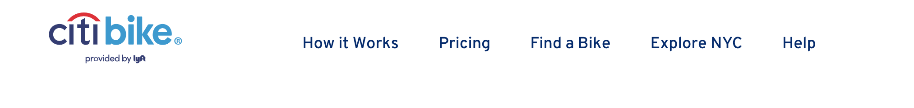
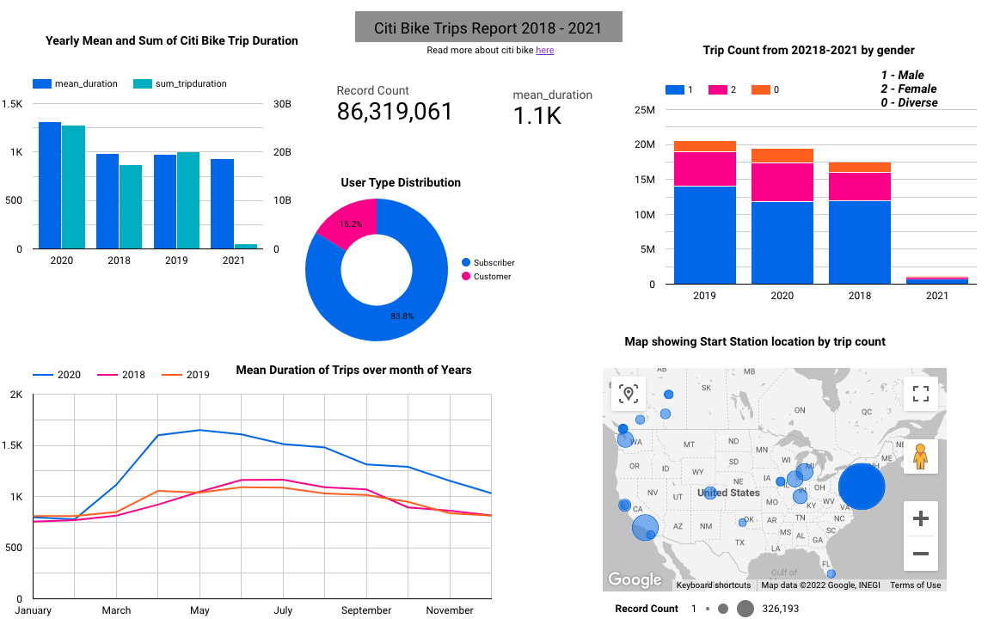

## Data Engineering Zoomcamp - Project

#### Problem Statement:
- The goal of this project is to build an ETL pipeline. The data would be processed as a batch (monthly) between 2018-01 and 2021-02. We will then build a dashboard from the data.

#### Dataset:
- I will be using the New york city - city bike trips data found at https://ride.citibikenyc.com/system-data. Citi Bike is the US largest bike share program, with 25,000 bikes and 1,500 stations across Manhattan, Brooklyn, Queens, the Bronx, Jersery City and Hoboken.

The citi bike trip histories include:  
- bike id  
- rideable type  
- start time  
- stop time  
- start_station_id  
- start_station_name  
- start_station_latitude  
- start_station_longitude  
- end_station_id  
- end_station_name  
- end_station_latitude  
- end_station_longitude  
- usertype  
- birth_year  
- gender  

#### Pipeline
In building the ETL pipeline, we take the following steps:
    - Ingesting the monthly citi-bike trips data to our GCS data lake
    - transfer the files from our data lake to BigQuery (Data-WareHouse)
    - perform basic data query and transformations like clustering and partitioning
    - connect bigQuery data to google studio to build report

#### Technologies

For this project we will the following software installed on your computer:

* Docker
* Cloud: GCP
* Data Warehouse: BigQuery
* Workflow orchestration: Airflow
* Infrastructure as code (IaC): Terraform
* Python 3 (e.g. via [Anaconda](https://www.anaconda.com/products/individual))
* Batch processing: Spark
* Google Cloud SDK

#### dashboard
The dashboard was built using *Data Studio*. You can find this link to the report here: https://datastudio.google.com/s/jyBfL9ioatU

The dashboard was downloaded and saved as pdf.

Here is a snapshot.

#### Folders and Files
1. airflow: contains dags, logs etc and airflow setup
2. img: contains all images used in the repo
3. test_data.ipynb: quick check of data files done locally in python
4. BigQuery_queries: contains all the sql queries used in BigQuery and comments.
5. Citi-bike_Report.pdf: quick pdf download of the dashboard from the data studio.

#### To Run
1. Read the README.md file
2. run `docker-compose build`  (make sure docker is installed and running locally)
3. run `docker-compose up`
- airflow should now be running at http://localhost:8081
- login details:  
--- username: airflow  
--- password: airflow
4. Run the dtc_project_ingest and project_gcs_2_bq dags.
